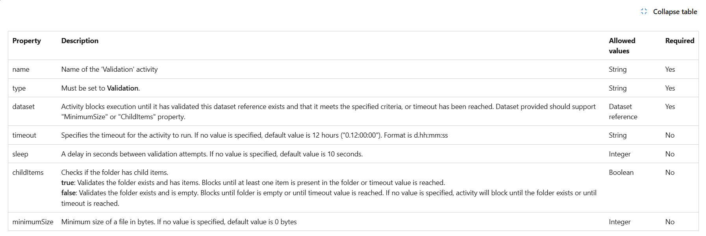
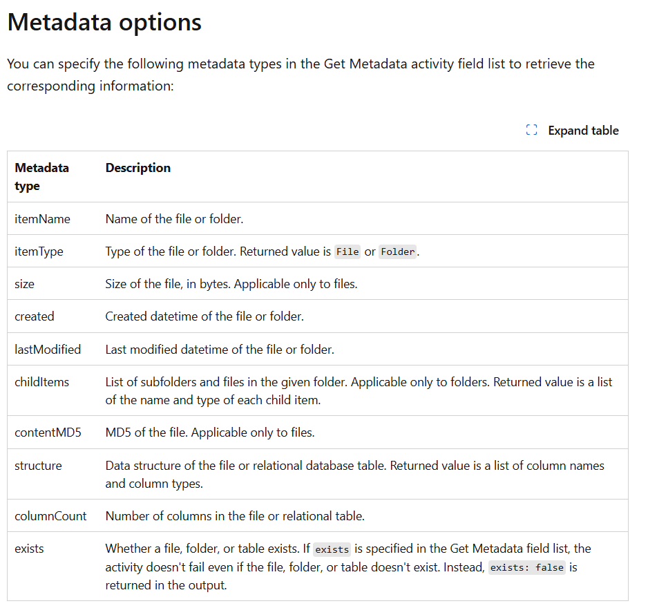

# 📘 Section : Data Ingestion from Azure Blob

## 🧠 What You Learned

**Purpose:** Move .tsv data from Blob to ADLS via ADF's Copy Activity.

---

### 🔧 Components Used

- **Blob Storage:** Source data (population file inside `.gz`)
- **ADLS Gen2:** Destination (organized in folders)
- **Linked Service:** Connection config for source/destination
- **Dataset:** Metadata descriptor pointing to file structure + path
- **Pipeline:** Wrapper for orchestration logic
- **Naming Convention:** Explained and followed as best practice to keep components clear and maintainable

---

### 📈 Real-World Scenarios Covered

#### 1️⃣ Execute pipeline **only when file is available** in Blob

- **Activity Used:** `Validation Activity`
- **Purpose:** Wait until file is detected before proceeding

#### 2️⃣ Proceed only **if file contents are valid**

- **Activities Used:** `Get Metadata Activity` + `If Condition Activity`
- **Purpose:** Validate file structure or properties (like row count or file type) before running core logic

#### 3️⃣ **Delete source file** after successful ingestion

- **Activity Used:** `Delete Activity`
- **Purpose:** Clean up raw zone after moving file to processed zone (ADLS)

---

### ⏱️ Trigger Types Explained

- **Storage Event Trigger:** Automatically starts pipeline when file is uploaded to Blob
- **Schedule Trigger:** Runs pipeline at fixed intervals (e.g., daily at 6 AM)
- **Tumbling Window Trigger:** Handles time-based slices of data with **exactly-once** execution; more suitable for time-series or batch pipelines

> 🔍 Note: Tumbling triggers may need additional understanding—left for future deep dive

---

### 📌 Summary

This section helped build confidence in using **Copy Activity** in combination with conditional logic and triggers to create production-ready ingestion pipelines.  
Instead of memorizing every setting, the focus was on understanding **how to design and control flow** with the right set of ADF components.
