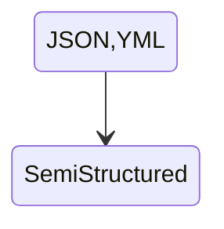
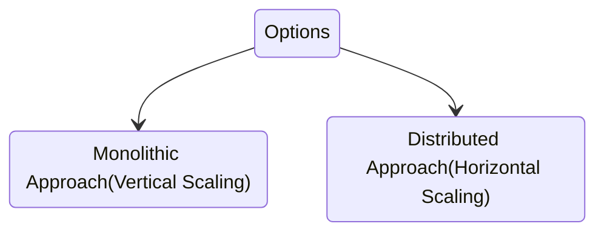

### Why Apache Spark?
In earlier days, to handle the data we were using **Database**

Database: Oracle,Teradata,MySQL,Exadata

> [!IMPORTANT]
> These systems were only supporting structure data

| Col1| Col2 | Col3 | Col4   |     
|-------|-------|-------|------|
|        |        |        |        |      
|        |        |        |        |    
|        |        |        |        |   
|        |        |        |        |    
|        |        |        |        |      

After invention of internet as it growed, different file format started generating

 File:Text,CSV,Image,Video,Audio etc.




  ### $Big\color{red}Data$
  
>[!NOTE]
> The definition of big data is data that contains greater variety, arriving in increasing volumes and with more velocity
  

```mermaid
stateDiagram
  direction RL
    state "3 V's of Big Data" as s1
    state "1 sec" as t1
    state "1 hour" as t2
    state "1 min" as t3
    state "Structured" as d1
    state "Semi-structured" as d2
    state "Unstructured" as d3
    state "5 GB" as g1
    state "10GB" as g2
    state "10TB" as g3
    s1 --> Velocity
    s1 --> Variety
    s1 --> Volume
   
    Volume --> v3
    Variety --> v2
    Velocity --> v1

    state v2{
      direction LR
      d1 --> d2
      d2 --> d3
    }
    state v3{
      direction LR
      g1 --> g2
      g2 --> g3
    }
    state v1{
      direction LR
      t1 --> t2
      t2 --> t3
    }

   d1 --> g1
   d2 --> g2
   d3 --> g3

   t1 --> d1
   t2 --> d2
   t3 --> d3
   v3 --> "BIGDATA"
  
```
**Issues**
1. Storage
2. Processing
   - RAM
   - CPU

```
Now there were two options to resolve these issues
```



|Monolithic|Distributed|     
|------|------|
|Vertical Scaling|Horizontal Scaling|   
| Expensive|Economical|   
| Low Availability|High Availability| 
| | |  

